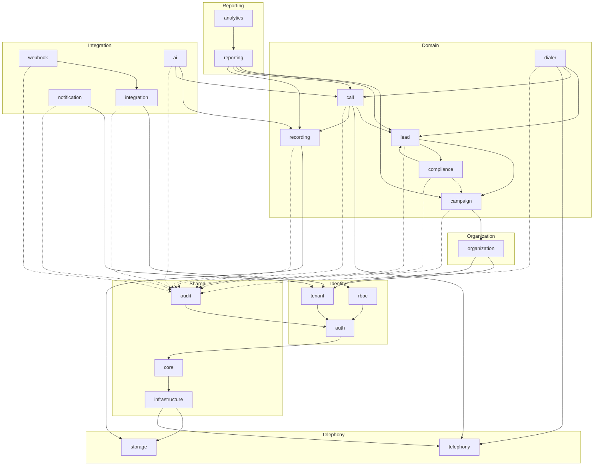

# 16 — Module Dependency Diagram

**Document Control**

| Property | Value |
|----------|-------|
| Title | Module Dependency Diagram |
| Version | 1.0.0 |
| Status | Draft |
| Author | Enterprise Architecture Team |
| Last Updated | 21-Jul-2026 |

---

## 1. Introduction

This document defines the module dependencies for the RDCS In-House Dialer Platform. It shows how domain modules relate to each other and to shared infrastructure.

## 2. Module Dependency Rules

- **Domain modules** may depend on shared core and infrastructure modules.
- **Domain modules** should not depend on each other except through domain events or well-defined application service interfaces.
- **Interface layer** (controllers, gateways) depends on the application layer of the same module.
- **Application layer** depends on the domain layer of the same module and repository interfaces.
- **Infrastructure layer** implements repository interfaces and external adapters.
- **Shared kernel** modules (auth, tenant, core) are allowed to be referenced by many modules.

## 3. Module Dependency Matrix

| Module | Depends On | Used By | Notes |
|--------|------------|---------|-------|
| core | - | all | base entities, events, result types |
| infrastructure | core | all | Prisma, Redis, BullMQ, S3, logger |
| auth | core, infrastructure | rbac, tenant, organization, all | JWT, sessions, MFA |
| rbac | core, infrastructure, auth | all | permission evaluation |
| tenant | core, infrastructure, auth | organization, all | tenant context |
| organization | core, infrastructure, tenant, rbac | campaign, lead, dialer, call, reporting | org hierarchy |
| campaign | core, infrastructure, tenant, organization, rbac | lead, dialer, call, reporting, compliance | campaign config |
| lead | core, infrastructure, tenant, organization, campaign, compliance | dialer, call, reporting | lead data |
| dialer | core, infrastructure, tenant, organization, campaign, lead, call, telephony | reporting | agent state, pacing |
| call | core, infrastructure, tenant, organization, campaign, lead, telephony, recording | reporting, analytics, ai | call lifecycle |
| recording | core, infrastructure, call, storage | ai, reporting | recordings |
| compliance | core, infrastructure, tenant, campaign, lead | dialer, call, reporting | DNC, timezone, TCPA |
| reporting | core, infrastructure, campaign, lead, call, recording | dashboard, analytics | reports |
| analytics | core, infrastructure, reporting | dashboard, ai | aggregates |
| integration | core, infrastructure, tenant, webhook | crm | API keys, connectors |
| webhook | core, infrastructure, tenant, integration | all | event delivery |
| notification | core, infrastructure, tenant | all | notifications |
| ai | core, infrastructure, recording, call | reporting, qa | AI jobs |
| audit | core, infrastructure, auth | all | audit logging |
| system | core, infrastructure, auth | admin | health, settings |
| telephony | core, infrastructure | dialer, call | adapter layer |
| storage | core, infrastructure | recording, export | S3/MinIO |

## 4. Dependency Diagram (Mermaid)

Solid arrows = direct dependency. Dashed arrows = audit event consumption.

## 5. Cycle Prevention

- The dependency graph is acyclic at the module level.
- Cross-domain communication uses domain events rather than direct service calls.
- Shared kernel modules are limited to core, auth, rbac, tenant, and infrastructure to avoid tight coupling.
- If a future requirement creates a cycle, refactor common interfaces into a shared module or use events.

## 6. Module Interface Contracts

Each module exposes a stable application interface to other modules:

- **Campaign Module**: `ICampaignService.getActiveCampaigns()`, `ICampaignService.validateCampaign()`.
- **Lead Module**: `ILeadService.getNextCallableLead()`, `ILeadService.markLeadStatus()`.
- **Dialer Module**: `IDialerService.agentReady()`, `IDialerService.getDialingDecision()`.
- **Call Module**: `ICallService.initiateCall()`, `ICallService.setDisposition()`.
- **Compliance Module**: `IComplianceService.isCallable()`, `IComplianceService.checkDnc()`.
- **Recording Module**: `IRecordingService.registerRecording()`, `IRecordingService.getPlaybackUrl()`.
- **Notification Module**: `INotificationService.send()`.
- **Webhook Module**: `IWebhookService.publishEvent()`.

Other modules consume these interfaces through NestJS dependency injection, not by importing internal implementation files.

## 7. Future Microservice Decomposition

The modular monolith can be decomposed into microservices along bounded context boundaries:

- **Identity Service**: auth, rbac, tenant.
- **Organization Service**: organization, users.
- **Campaign & Lead Service**: campaign, lead, compliance.
- **Dialer Service**: dialer, call, telephony adapter.
- **Recording & AI Service**: recording, ai.
- **Reporting & Analytics Service**: reporting, analytics.
- **Integration Service**: integration, webhook, notification.
- **Admin Service**: system, audit.

Shared events and API contracts are already designed for this boundary.
