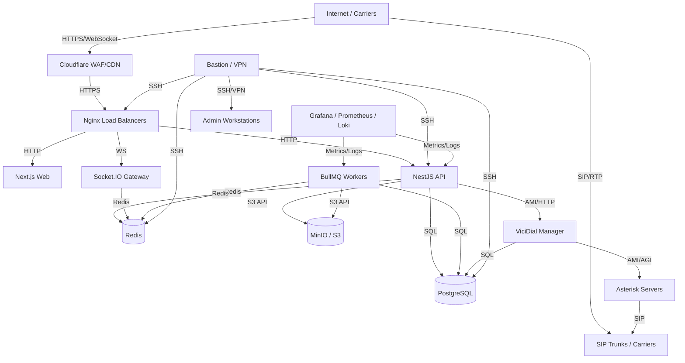

# 19 — Network Architecture

**Document Control**

| Property | Value |
|----------|-------|
| Title | Network Architecture |
| Version | 1.0.0 |
| Status | Draft |
| Author | Enterprise Architecture Team |
| Last Updated | 21-Jul-2026 |

---

## 1. Introduction

This document defines the network architecture for the RDCS In-House Dialer Platform. It covers segmentation, traffic flows, firewall rules, DNS, and security zones.

## 2. Network Design Principles

- **Defense in Depth**: Multiple security layers (Cloudflare, WAF, Nginx, internal firewalls).
- **Segmentation**: Separate zones for public, application, data, telephony, and management.
- **Least Privilege**: Only required ports and protocols open between zones.
- **Encrypted Transit**: TLS 1.2+ for all external and internal HTTP traffic; SIP-TLS where supported.
- **High Availability**: Redundant paths and load balancers.

## 3. Network Zones

### 3.1 Public Zone (DMZ)
- **Components**: Cloudflare, Nginx load balancers, bastion host.
- **Access**: Public internet inbound (HTTPS, WebSocket); outbound to application zone.
- **Purpose**: Terminate public traffic, apply WAF rules, TLS offloading.

### 3.2 Application Zone
- **Components**: Next.js web, NestJS API, Socket.IO gateway, workers, Prometheus/Loki/Grafana (admin access only).
- **Access**: Inbound from DMZ; outbound to data zone and telephony zone.
- **Purpose**: Run application logic.

### 3.3 Data Zone
- **Components**: PostgreSQL primary/replica, Redis, MinIO/S3.
- **Access**: Inbound from application zone only; no direct public access.
- **Purpose**: Store transactional data, cache, sessions, object storage.

### 3.4 Telephony Zone
- **Components**: ViciDial manager, Asterisk servers, SIP proxies, recording storage.
- **Access**: Inbound SIP/RTP from carriers; inbound control from application zone; outbound to carriers.
- **Purpose**: Call signaling and media handling.

### 3.5 Management Zone
- **Components**: Bastion, VPN server, monitoring tools, CI/CD runners, backup servers.
- **Access**: Restricted to admin IPs and VPN.
- **Purpose**: Administrative access, monitoring, backups, deployments.

## 4. Network Diagram (Mermaid)

## 5. Traffic Flows

### 5.1 User Web Request
1. User → Cloudflare (DNS + WAF).
2. Cloudflare → Nginx (HTTPS).
3. Nginx → Next.js web container.
4. Next.js container calls API via internal network.

### 5.2 API Request
1. Client / Worker → Nginx.
2. Nginx → NestJS API container.
3. API → PostgreSQL / Redis / S3 / Telephony adapter.
4. API may emit events to Redis Pub/Sub or BullMQ.

### 5.3 Real-Time Event
1. Telephony adapter / API publishes event to Redis.
2. Socket.IO gateway subscribes and pushes to client room.
3. Client receives event via WebSocket.

### 5.4 Call Flow
1. API → Telephony adapter (HTTP/AMI).
2. Adapter → Asterisk → SIP trunk → carrier → phone.
3. Asterisk events → adapter → API → Redis/Socket.IO.
4. Recording file captured on Asterisk → uploaded to S3/MinIO.

### 5.5 Management Access
1. Admin → VPN/Bastion.
2. Bastion → SSH/RDP to target servers in private zones.
3. All admin access logged and MFA-enforced.

## 6. Firewall Rules

### 6.1 Public Facing (Nginx / Cloudflare)

| Source | Port | Protocol | Destination | Action |
|--------|------|----------|-------------|--------|
| Internet | 443 | TCP | Nginx | Allow |
| Internet | 80 | TCP | Nginx | Redirect to 443 |
| Cloudflare IPs | 443 | TCP | Nginx | Allow |
| All | 22 | TCP | Nginx | Deny |

### 6.2 Application Zone

| Source | Port | Protocol | Destination | Action |
|--------|------|----------|-------------|--------|
| Nginx | 3000 | TCP | Next.js | Allow |
| Nginx | 4000 | TCP | API | Allow |
| Nginx | 4001 | TCP | Socket.IO | Allow |
| API | 5432 | TCP | PostgreSQL | Allow |
| API/Workers | 6379 | TCP | Redis | Allow |
| API/Workers | 9000 | TCP | MinIO | Allow |
| API | 5038/8088 | TCP | ViciDial/Asterisk | Allow |
| Workers | 5432 | TCP | PostgreSQL | Allow |
| Workers | 6379 | TCP | Redis | Allow |
| Workers | 9000 | TCP | MinIO | Allow |
| Monitoring | 9090 | TCP | Prometheus | Allow |
| Monitoring | 3100 | TCP | Loki | Allow |
| All | 22 | TCP | App Servers | Deny (via bastion only) |

### 6.3 Data Zone

| Source | Port | Protocol | Destination | Action |
|--------|------|----------|-------------|--------|
| API/Workers | 5432 | TCP | PostgreSQL | Allow |
| API/Workers | 6379 | TCP | Redis | Allow |
| API/Workers | 9000 | TCP | MinIO | Allow |
| PostgreSQL Primary | 5432 | TCP | PostgreSQL Replica | Allow |
| Redis | 6379 | TCP | Redis Sentinel | Allow |
| MinIO | 9000 | TCP | MinIO nodes | Allow |
| All | 22 | TCP | Data Servers | Deny (via bastion only) |

### 6.4 Telephony Zone

| Source | Port | Protocol | Destination | Action |
|--------|------|----------|-------------|--------|
| Carriers | 5060 | UDP/TCP | Asterisk | Allow (SIP) |
| Carriers | 10000-20000 | UDP | Asterisk | Allow (RTP) |
| API | 5038 | TCP | Asterisk (AMI) | Allow |
| API | 8088 | TCP | Asterisk (ARI) | Allow |
| ViciDial | 3306 | TCP | ViciDial DB | Allow |
| Asterisk | 3306 | TCP | ViciDial DB | Allow |
| All | 22 | TCP | Telephony Servers | Deny (via bastion only) |

### 6.5 Management Zone

| Source | Port | Protocol | Destination | Action |
|--------|------|----------|-------------|--------|
| Admin IPs | 443 | TCP | VPN Server | Allow |
| VPN Clients | 22 | TCP | All zones | Allow (logged) |
| CI/CD | 22 | TCP | App Servers | Allow (key-based) |
| Monitoring | 9100 | TCP | Node Exporter | Allow |

## 7. DNS Configuration

| Record | Type | Target | Purpose |
|--------|------|--------|---------|
| app.rdcs.example.com | A/AAAA | Cloudflare | Main application |
| api.rdcs.example.com | A/AAAA | Cloudflare | API endpoints |
| ws.rdcs.example.com | A/AAAA | Cloudflare | WebSocket gateway |
| *.rdcs.example.com | A/AAAA | Cloudflare | Tenant subdomains (future) |
| sip.rdcs.example.com | A/AAAA | Asterisk pool | SIP endpoint |
| monitor.rdcs.example.com | A/AAAA | Nginx/Grafana | Monitoring (IP-restricted) |

## 8. TLS / Certificate Management

- Let's Encrypt certificates for public-facing domains via certbot or Cloudflare Origin CA.
- Internal services use self-signed CA or cert-manager (Kubernetes future).
- Certificate renewal automated and monitored.
- TLS 1.2+ enforced; weak cipher suites disabled.

## 9. DDoS & WAF

- Cloudflare handles Layer 3/4 DDoS mitigation and Layer 7 WAF rules.
- Rate limiting applied at Cloudflare and Nginx.
- Geo-blocking and bot protection configurable.
- Custom WAF rules for API abuse patterns.

## 10. VPN & Bastion

- WireGuard or OpenVPN for admin access.
- Bastion host is the only SSH entry point to private networks.
- MFA required for VPN and bastion access.
- SSH key-based auth only; password auth disabled.
- Session recording for privileged access (optional).

## 11. Telephony Network Considerations

- Asterisk servers need public IPs or 1:1 NAT for SIP/RTP.
- Use STUN/TURN servers if agents are behind NAT (WebRTC).
- QoS marking for RTP traffic where network supports it.
- Multiple SIP trunks for carrier redundancy.
- SBC (Session Border Controller) for security and NAT traversal if scale requires.

## 12. Monitoring of Network

- Network throughput, latency, and error rates monitored via Prometheus Node Exporter and Cloudflare analytics.
- Alerts for unusual traffic spikes, port scans, and failed connections.
- Flow logs captured where available.

## 13. Future Enhancements

- Segment API and worker networks further if needed.
- Implement service mesh (e.g., Istio) for Kubernetes with mTLS.
- Zero-trust network access for remote engineering.
- Anycast or multi-region load balancing for global reach.
