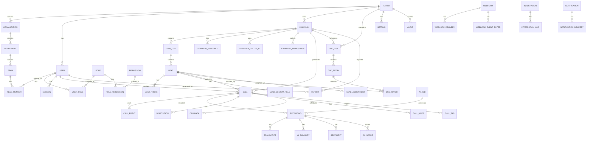

# 32 — ER Diagram

**Document Control**

| Property | Value |
|----------|-------|
| Title | ER Diagram |
| Version | 1.0.0 |
| Status | Draft |
| Author | Enterprise Architecture Team |
| Last Updated | 21-Jul-2026 |

---

## 1. Introduction

This document provides the Entity-Relationship (ER) diagram for the RDCS In-House Dialer Platform. It describes the major entities and their relationships.

## 2. ER Diagram (Mermaid)

## 3. Entity Descriptions

### Tenant
- Top-level organizational boundary.
- Contains organizations, users, campaigns, settings, and audit logs.
- All data isolated by `tenantId`.

### Organization
- Belongs to one tenant.
- Contains departments.
- Represents a company or division.

### Department
- Belongs to one organization.
- Contains teams and campaigns.
- Used for data scoping and reporting.

### Team
- Belongs to one department.
- Contains team members (users/agents).
- Campaigns can be assigned to teams.

### User
- Belongs to one tenant.
- Has roles, sessions, and team memberships.
- Can be an agent, supervisor, admin, etc.

### Role
- Belongs to one tenant or predefined globally.
- Has permissions.
- Users assigned to roles via `user_roles`.

### Permission
- Global or tenant-scoped permission definition.
- Linked to roles via `role_permissions`.

### Campaign
- Belongs to one tenant and optionally department.
- Has lead lists, schedules, caller IDs, dispositions.
- Generates calls.

### LeadList
- Belongs to one campaign.
- Container for leads imported together.

### Lead
- Belongs to one lead list and campaign.
- Has phone numbers, status, timezone, custom fields.
- Can be assigned to team/agent.

### LeadPhone
- Phone number for a lead.
- Supports primary, secondary, mobile, landline types.

### Call
- Belongs to one campaign, lead, and agent.
- Has state, duration, disposition, recording.
- Emits call events.

### CallEvent
- Detailed event in a call lifecycle.
- Examples: initiated, ringing, answered, hangup, amd.

### Recording
- Metadata for a call recording.
- Links to storage path, duration, encryption.
- Has transcripts, summaries, QA scores.

### Transcript
- Speech-to-text output for a recording.
- Segment-level text with timestamps.

### Sentiment
- Sentiment classification for a call or segment.

### QaScore
- Quality assurance score for a call.
- Based on rubric criteria.

### Disposition
- Outcome code applied to a call.
- Belongs to a campaign disposition set.

### Callback
- Scheduled future call to a lead.
- Linked to a call and lead.

### DncList
- Do Not Call list per tenant.
- Contains DNC entries.

### DncEntry
- Phone number and metadata in a DNC list.

### DncMatch
- Record of lead matching DNC entry.
- Used for audit and compliance.

### Audit
- Immutable audit log entry.
- Records actor, action, resource, before/after snapshot.

### Webhook
- Webhook subscription per tenant.
- Has URL, secret, event filters, retry policy.

### WebhookDelivery
- Record of each webhook delivery attempt.

### Integration
- CRM integration configuration.
- Has settings, credentials, mapping.

### Notification
- Notification record.
- Has delivery attempts across channels.

### Setting
- Tenant or system configuration key-value store.

### Session
- User authentication session.
- Linked to refresh token in Redis.

## 4. Relationship Cardinality Summary

| Parent Entity | Child Entity | Cardinality | Cascade |
|---------------|--------------|-------------|---------|
| Tenant | Organization | 1:N | Soft delete cascade |
| Organization | Department | 1:N | Soft delete cascade |
| Department | Team | 1:N | Soft delete cascade |
| Team | TeamMember | 1:N | Delete cascade |
| User | TeamMember | 1:N | Delete cascade |
| User | UserRole | 1:N | Delete cascade |
| Role | UserRole | 1:N | Delete cascade |
| Role | RolePermission | 1:N | Delete cascade |
| Campaign | LeadList | 1:N | Soft delete cascade |
| Campaign | CampaignSchedule | 1:N | Delete cascade |
| Campaign | CampaignCallerId | 1:N | Delete cascade |
| Campaign | CampaignDisposition | 1:N | Delete cascade |
| Campaign | Call | 1:N | Soft delete cascade |
| LeadList | Lead | 1:N | Soft delete cascade |
| Lead | LeadPhone | 1:N | Delete cascade |
| Lead | LeadCustomField | 1:N | Delete cascade |
| Lead | Call | 1:N | Soft delete set null |
| Call | CallEvent | 1:N | Delete cascade |
| Call | Recording | 1:1 | Delete cascade |
| Call | Callback | 1:N | Delete cascade |
| Call | CallNote | 1:N | Delete cascade |
| Recording | Transcript | 1:1 | Delete cascade |
| Recording | AiSummary | 1:1 | Delete cascade |
| Recording | Sentiment | 1:N | Delete cascade |
| Recording | QaScore | 1:N | Delete cascade |
| Tenant | DncList | 1:N | Soft delete cascade |
| DncList | DncEntry | 1:N | Delete cascade |
| Tenant | Webhook | 1:N | Soft delete cascade |
| Webhook | WebhookDelivery | 1:N | Delete cascade |
| Tenant | Integration | 1:N | Soft delete cascade |
| Tenant | Notification | 1:N | Soft delete cascade |
| Tenant | Audit | 1:N | No delete (immutable) |
| Tenant | Setting | 1:N | Delete cascade |
| User | Session | 1:N | Delete cascade |

## 5. Constraints

- `tenantId` NOT NULL on all data tables.
- Unique constraints on email within tenant.
- Unique constraints on phone number within campaign (configurable).
- Foreign key constraints with appropriate cascade rules.
- Check constraints on status/state enums.
- NOT NULL on required fields per business rules.

## 6. Indexes

Primary and foreign keys automatically indexed. Additional indexes detailed in `34-index-strategy.md`.
