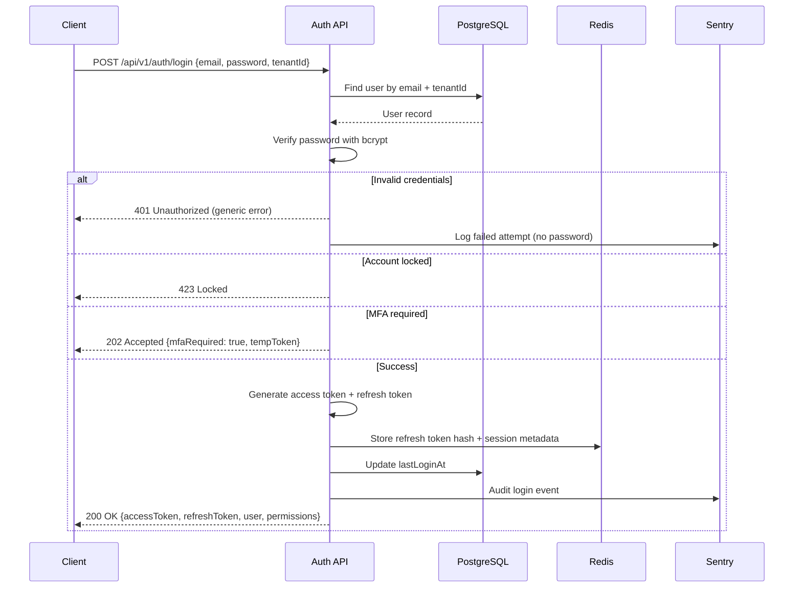
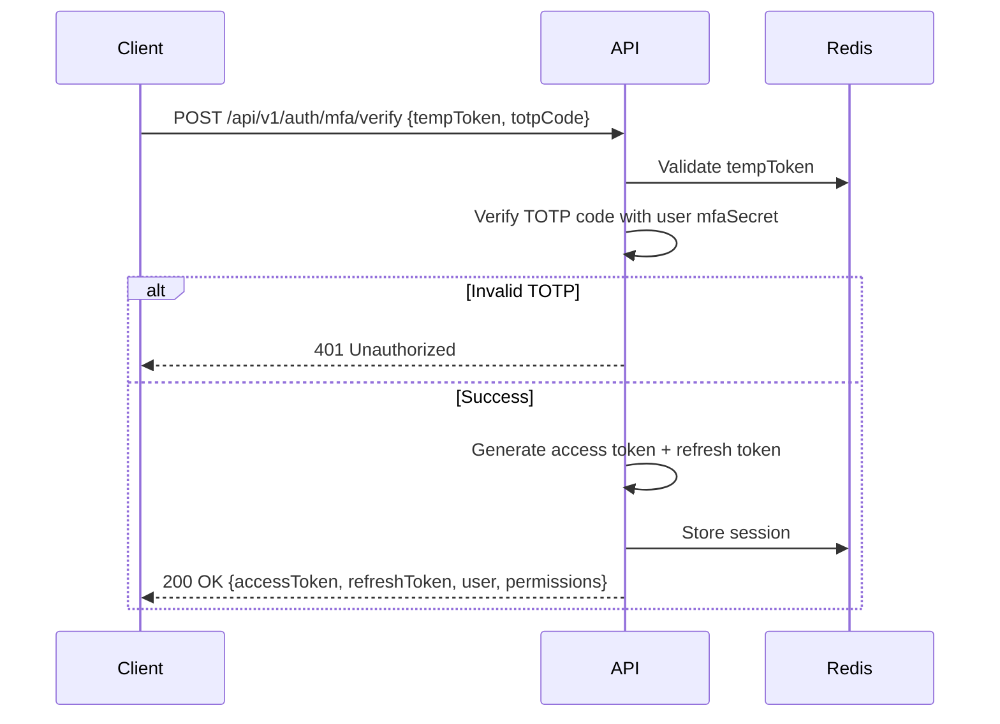
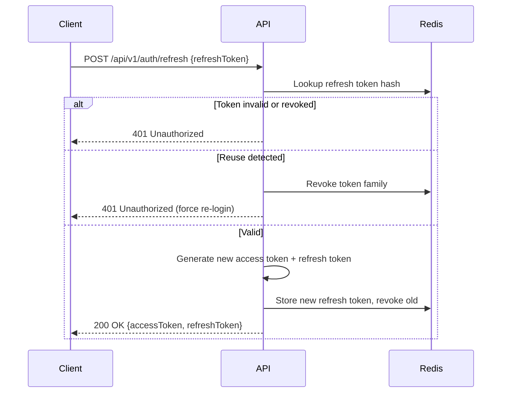
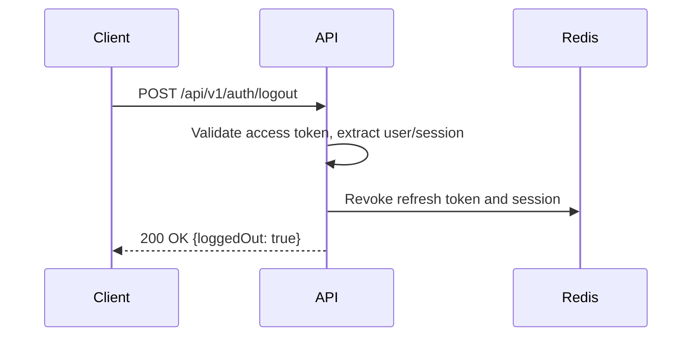

# 38 — Authentication Flow

**Document Control**

| Property | Value |
|----------|-------|
| Title | Authentication Flow |
| Version | 1.0.0 |
| Status | Draft |
| Author | Enterprise Architecture Team |
| Last Updated | 21-Jul-2026 |

---

## 1. Introduction

This document defines the authentication flow for the RDCS In-House Dialer Platform. Authentication is developed in-house and supports email/password, JWT, refresh tokens, MFA/TOTP, and enterprise SSO (SAML/OIDC).

## 2. Authentication Methods

| Method | Description | Use Case |
|--------|-------------|----------|
| Email/Password | In-house credential authentication | Default login |
| JWT Access Token | Short-lived bearer token for API access | API/WebSocket auth |
| Refresh Token | Long-lived token for access token renewal | Silent re-authentication |
| TOTP MFA | Authenticator app one-time passcode | Privileged accounts |
| SAML 2.0 | Enterprise SSO via identity provider | Enterprise customers |
| OIDC | OAuth2/OIDC-based SSO | Enterprise customers |
| API Key | Tenant-scoped key for integrations | CRM/integrations |

## 3. Token Strategy

### 3.1 Access Token

- Type: JWT (RS256 or HS256).
- Lifetime: 15 minutes.
- Payload:
  - `sub`: userId
  - `tenantId`: current tenant
  - `roles`: role IDs
  - `permissions`: cached permission list (optional)
  - `iat`, `exp`, `jti`
- Stored in: Authorization header (`Bearer <token>`).

### 3.2 Refresh Token

- Type: opaque random string or JWT.
- Lifetime: 7 days (configurable) or until revoked.
- Stored in: http-only, secure, SameSite cookie or secure storage.
- Hashed and stored in Redis/PostgreSQL with user/session metadata.
- Rotated on each use; reused detection invalidates family.

## 4. Login Flow

### 4.1 Email/Password Login



### 4.2 MFA Verification



## 5. Token Refresh Flow



## 6. Logout Flow



## 7. SSO Flow (SAML 2.0)

1. User clicks "Login with SSO" on tenant subdomain.
2. Backend identifies tenant's IdP configuration.
3. Backend generates SAML AuthnRequest and redirects user to IdP.
4. IdP authenticates user and POSTs SAML Response to backend ACS endpoint.
5. Backend validates SAML assertion, extracts user attributes.
6. If user does not exist, JIT provision with default role.
7. Backend creates session and tokens, redirects to app.

## 8. SSO Flow (OIDC)

1. User clicks "Login with OIDC".
2. Backend redirects to IdP authorization endpoint with PKCE/state.
3. IdP redirects back with authorization code.
4. Backend exchanges code for tokens at IdP token endpoint.
5. Backend validates ID token, extracts user info.
6. JIT provision or link existing user.
7. Create session and tokens, redirect to app.

## 9. Password Reset Flow

1. User requests password reset with email.
2. Backend generates single-use token with 1-hour expiry.
3. Token hash stored in Redis/DB; reset email sent with link.
4. User clicks link, submits new password.
5. Backend validates token, updates password hash, invalidates all sessions.
6. User must log in again.

## 10. Account Lockout

- After 5 failed login attempts, account locked for 30 minutes.
- Lockout counter resets on successful login.
- Admin can manually unlock account.
- Lockout events logged and optionally alerted.

## 11. Session Management

- Sessions stored in Redis with metadata.
- Users can view active sessions and revoke them.
- Session TTL refreshed on activity.
- Idle timeout: 30 minutes; max session lifetime: 12 hours.

## 12. API Key Authentication

- Integrations use `X-API-Key` header.
- API key hashed in database; plaintext shown only once on creation.
- API key linked to tenant and permission set.
- API key can be rotated or revoked.

## 13. WebSocket Authentication

- Socket.IO handshake includes access token as query parameter or auth payload.
- Server validates token and joins user to tenant/department/user rooms.
- On token expiry, client refreshes and reconnects.

## 14. Security Considerations

- Passwords hashed with bcrypt (cost factor 12+).
- JWT secret stored in secret manager, rotated periodically.
- Tokens transmitted over HTTPS only.
- Refresh tokens in http-only cookies with SameSite=Strict/None (secure).
- MFA secrets encrypted at rest.
- Brute-force protection on login and MFA endpoints.
- Audit logging of all auth events.

## 15. Token Validation Sequence

```
Client Request
  │
  ▼
Extract Authorization Bearer token
  │
  ▼
Verify JWT signature and expiration
  │
  ▼
Extract tenantId, userId, roles
  │
  ▼
Check tenant status (active/suspended)
  │
  ▼
Check user status (active)
  │
  ▼
Attach user context to request
  │
  ▼
Proceed to authorization/permission check
```

## 16. Endpoints

See `40-rest-api-documentation.md` for detailed authentication endpoint specifications.
