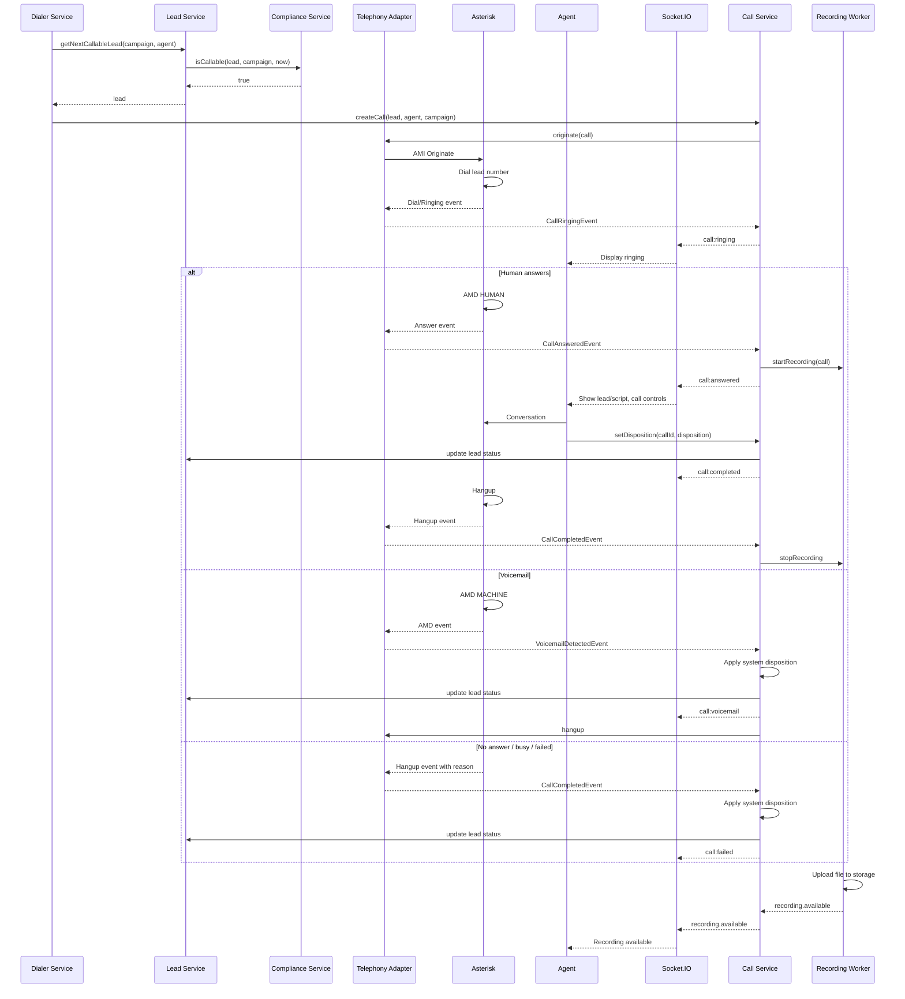

# 46 — Call Flow

**Document Control**

| Property | Value |
|----------|-------|
| Title | Call Flow |
| Version | 1.0.0 |
| Status | Draft |
| Author | Enterprise Architecture Team |
| Last Updated | 21-Jul-2026 |

---

## 1. Introduction

This document defines the call flow for the RDCS In-House Dialer Platform. It covers the entire lifecycle of an outbound call from decision to hangup, including disposition, recording, and callback handling.

## 2. Call Flow Overview

## 3. Call States

| State | Description |
|-------|-------------|
| initiated | Call created, origination sent to telephony adapter |
| ringing | Remote end is ringing |
| answered | Call answered by human or machine |
| voicemail | Voicemail/answering machine detected |
| busy | Called party busy |
| no-answer | No answer within timeout |
| failed | Network, channel, or carrier failure |
| completed | Call ended normally |
| transferred | Call transferred to another destination |

## 4. Manual Dial Flow

1. Agent selects a lead and clicks dial.
2. Call Service validates lead callability and permission.
3. Call record created in `initiated` state.
4. Adapter originates call to lead number.
5. Agent's phone rings; on answer, lead is connected.
6. Agent sees lead details and script.
7. Call ends; agent sets disposition.

## 5. Preview Dial Flow

1. Dialer presents next lead to agent.
2. Agent reviews lead and clicks accept or skip.
3. If accepted, call originates as manual dial.
4. If skipped, lead is dispositioned as skipped and next lead offered.

## 6. Progressive Dial Flow

1. Agent sets status to available.
2. Dialer Worker selects next callable lead.
3. Call originates automatically when agent is ready.
4. Agent's phone rings; on answer, agent connected to lead.

## 7. Power/Predictive Dial Flow

1. Dialer Worker predicts agent availability and dials multiple leads.
2. Calls connect without pre-assigned agents.
3. On human answer, available agent is selected and bridged.
4. If no agent available, call is abandoned (recorded for compliance).
5. Voicemail/busy/no-answer handled by system dispositions.

## 8. Disposition Flow

1. Agent or system selects disposition.
2. Call record updated with disposition.
3. Lead status updated based on disposition category.
4. If callback disposition, callback record created.
5. If DNC disposition, lead marked DNC.
6. Compliance and reporting events emitted.
7. Agent enters wrap-up.

## 9. Callback Flow within Call

1. Agent sets callback disposition or schedules callback.
2. Callback record created with scheduled time/timezone.
3. Lead status set to `callback`.
4. Callback job queued for scheduled time.
5. At scheduled time, callback lead re-enters callable queue.

## 10. Transfer Flow

1. Agent requests transfer during active call.
2. System validates transfer destination and permission.
3. Adapter initiates transfer (warm or cold).
4. Call state updated to `transferred`.
5. Original agent may drop off or consult.
6. Event emitted for monitoring and reporting.

## 11. Hold, Mute, DTMF

| Action | Flow |
|--------|------|
| Hold | Adapter sends hold command; lead hears hold music; agent status updated |
| Resume | Adapter sends resume; conversation continues |
| Mute | Adapter mutes agent leg; agent can still hear |
| DTMF | Adapter sends digits to lead's line |
| Conference | Adapter bridges additional parties |

## 12. Abandonment Handling

- Predictive/power calls that connect to a human without an available agent are abandoned.
- Asterisk plays a brief informational message before hanging up.
- Call marked `isAbandoned = true`.
- Abandon rate tracked per campaign.
- If abandon rate exceeds threshold, dialing throttled or paused.

## 13. Compliance Checks During Call

- DNC re-check before every originate.
- Timezone window check before originate.
- Consent check before recording start.
- Abandon rate monitoring during predictive/power dialing.
- Violations logged and alerted.

## 14. Event Emissions

| Event | Emitted When |
|-------|--------------|
| CallInitiated | Call record created and adapter originates |
| CallRinging | Remote end ringing |
| CallAnswered | Human answers |
| VoicemailDetected | AMD detects machine |
| CallCompleted | Call ends |
| DispositionSet | Disposition applied |
| CallbackScheduled | Callback created |
| CallTransferred | Transfer initiated/completed |
| RecordingStarted | Recording begins |
| RecordingAvailable | Recording uploaded |

## 15. Failure Handling

| Scenario | Handling |
|----------|----------|
| Trunk failure | Mark call failed, retry alternate trunk, apply failed disposition |
| Agent unavailable | Requeue call, mark agent away |
| Lead not callable | Skip and select next lead, log reason |
| Adapter disconnect | Buffer events, reconcile via CDR on reconnect |
| Disposition timeout | Force system disposition after wrap-up expires |

## 16. Monitoring

- Call volume, state transitions, and durations.
- Connection rate, abandon rate, and failure reasons.
- Adapter event latency.
- Disposition capture rate and time.
- Wrap-up adherence.
