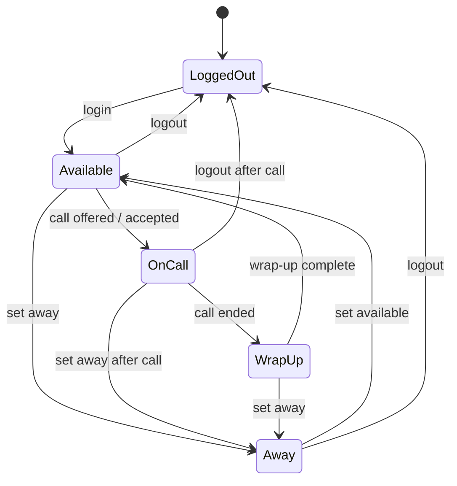

# 47 — Dialing Flow

**Document Control**

| Property | Value |
|----------|-------|
| Title | Dialing Flow |
| Version | 1.0.0 |
| Status | Draft |
| Author | Enterprise Architecture Team |
| Last Updated | 21-Jul-2026 |

---

## 1. Introduction

This document defines the dialing flow for the RDCS In-House Dialer Platform. It covers manual, preview, progressive, power, and predictive dialing modes, including agent state management, pacing, and compliance.

## 2. Dialing Modes

| Mode | Description | Agent Involvement |
|------|-------------|-------------------|
| Manual | Agent selects and dials a lead | Full control |
| Preview | Lead presented; agent accepts or skips | Accept/skip decision |
| Progressive | System dials next lead when agent is ready | Minimal (wait for connect) |
| Power | Multiple calls dialed per agent; answered calls connected | Minimal |
| Predictive | System dials based on statistical predictions to maximize utilization | Minimal |

## 3. Agent State Machine



## 4. Manual Dialing Flow

1. Agent selects a lead from their list.
2. System validates callability (status, DNC, timezone, permission).
3. Agent clicks call button.
4. Call record created.
5. Adapter originates call to lead.
6. Agent phone rings and connects to lead.
7. Agent handles call and sets disposition.

## 5. Preview Dialing Flow

1. Agent sets status to Available.
2. System selects next callable lead based on priority and rules.
3. Lead presented to agent with accept/skip buttons.
4. Preview timer starts.
5. Agent accepts: system originates call.
6. Agent skips: lead marked skipped, next lead presented.
7. Timer expires: lead auto-skipped.

## 6. Progressive Dialing Flow

1. Agent sets status to Available.
2. Dialer Worker detects available agent.
3. System selects next callable lead.
4. Call originated automatically.
5. Agent's phone rings; on answer, agent is bridged to lead.
6. Agent handles call and sets disposition.
7. Agent returns to Available after wrap-up.

## 7. Power Dialing Flow

1. Multiple agents are available.
2. Dialer dials N leads per available agent (configured lines-per-agent).
3. Calls connect to agents as they become free.
4. Unanswered/busy/voicemail calls receive system dispositions.
5. Answered calls connected to next available agent.
6. If human answers but no agent is available, call is abandoned.

## 8. Predictive Dialing Flow

1. Dialer analyzes historical data: answer rate, average handle time, agent availability.
2. Pacing algorithm calculates optimal number of calls to place.
3. System dials predicted number of leads.
4. As calls answer and agents become available, calls are bridged.
5. Abandon rate monitored continuously.
6. If abandon rate exceeds threshold, pacing reduced or dialing paused.
7. Over time, algorithm adapts to actual answer rates.

## 9. Next Lead Selection Logic

Selection criteria:
- Lead status = `callable`.
- Not in DNC list.
- Within timezone calling window.
- Campaign is active and not paused.
- Priority (higher first).
- Last dialed time (recycle interval elapsed).
- Assignment rules (team, agent, pool).
- Custom filters (skill, language, region).

```typescript
interface LeadSelectionCriteria {
  campaignId: string;
  agentId?: string;
  teamIds?: string[];
  departmentIds?: string[];
  mode: DialingMode;
  now: Date;
  excludeLeadIds: string[];
}
```

## 10. Pacing Algorithm (Predictive)

Inputs:
- Number of available agents.
- Historical answer rate (e.g., 30%).
- Average handle time (e.g., 180 seconds).
- Target abandon rate (e.g., 3%).
- Current abandon rate (rolling 60 minutes).

Calculation:

```
dialsToPlace = max(availableAgents * factor, 1)
factor = (1 / answerRate) * utilizationTarget
if currentAbandonRate > targetAbandonRate:
    factor = factor * 0.5  // throttle
if currentAbandonRate > targetAbandonRate * 1.5:
    pauseDialing()
```

## 11. Abandon Rate Guard

- Abandon rate = abandoned calls / answered calls over rolling 60-minute window.
- If threshold exceeded, reduce predictive/power dial factor.
- If critical threshold exceeded, pause dialing for campaign.
- Supervisor notified.
- Compliance event logged.

## 12. Lead Reservation

To prevent double-dialing:
- Lead reserved for an agent/call using Redis distributed lock.
- Lock held during call setup and early call state.
- Lock released if call fails or is abandoned.
- Other dialers skip reserved leads.

## 13. Wrap-Up Management

- After call ends, agent enters wrap-up state.
- Wrap-up duration configurable per campaign.
- Agent can end wrap-up early if allowed.
- During wrap-up, agent is not offered new calls.
- If disposition is required, agent cannot exit wrap-up without it.

## 14. Dialer Worker Loop

```
while true:
  for each active campaign:
    if campaign paused or outside schedule: continue
    if abandon rate exceeded: continue
    availableAgents = getAvailableAgents(campaign)
    if availableAgents == 0: continue
    if mode == predictive or power:
      dials = calculatePacing(campaign, availableAgents)
    else if mode == progressive:
      dials = availableAgents
    else: continue
    for i in 1..dials:
      lead = selectNextCallableLead(campaign, availableAgents)
      if lead == null: break
      reserveLead(lead)
      if mode == progressive or manual or preview:
        assignAgent(agent, lead)
      createCall(lead, campaign, mode)
      originateCall(call)
  sleep(config.loopIntervalMs)
```

## 15. Compliance Integration

Every dial decision consults Compliance Service:
- DNC status.
- Timezone window.
- Consent (for recording).
- Campaign schedule.
- Abandon rate guard.
- TCPA safe harbor rules.

## 16. Real-Time Updates

- Agent status changes pushed via Socket.IO.
- Campaign metrics updated every 5 seconds.
- Supervisor dashboard shows agent state and dialer decisions.
- Alerts on abnormal conditions (no available agents, high abandon rate).

## 17. Monitoring

- Dials per minute per campaign.
- Answer rate and connection rate.
- Abandon rate (current and trend).
- Agent utilization.
- Average handle time and wrap-up time.
- Lead pool depth and recycle rate.
- Dialer decision latency.
