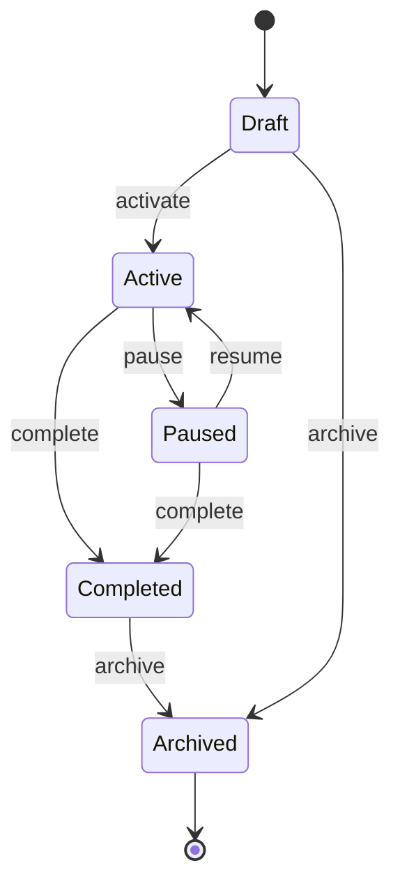

# 48 — Campaign Flow

**Document Control**

| Property | Value |
|----------|-------|
| Title | Campaign Flow |
| Version | 1.0.0 |
| Status | Draft |
| Author | Enterprise Architecture Team |
| Last Updated | 21-Jul-2026 |

---

## 1. Introduction

This document defines the campaign lifecycle and operational flow for the RDCS In-House Dialer Platform.

## 2. Campaign Lifecycle

## 3. Campaign Statuses

| Status | Description | Dialing Allowed | Editable |
|--------|-------------|-----------------|----------|
| draft | Campaign being configured | No | Yes |
| active | Campaign running | Yes | Limited (schedules, pacing) |
| paused | Campaign temporarily stopped | No | Yes |
| completed | Campaign finished | No | No |
| archived | Campaign read-only | No | No |

## 4. Campaign Creation Flow

1. Operations Manager or Supervisor navigates to New Campaign.
2. Enters name, description, department, dialing mode.
3. Configures schedules, caller IDs, disposition set.
4. Sets compliance rules (DNC lists, timezone window, consent, abandon target).
5. Configures pacing (for predictive/power/progressive).
6. Saves campaign in `draft` status.
7. CampaignCreated event emitted.

## 5. Campaign Activation Flow

1. User triggers activation.
2. System validates:
   - Campaign is in `draft` or `paused`.
   - Campaign has at least one valid caller ID.
   - Campaign has at least one lead list with callable leads (or exception approved).
   - Schedules and compliance rules are configured.
   - User has `campaign:update` permission.
3. Campaign status changes to `active`.
4. CampaignActivated event emitted.
5. Dialer Worker begins selecting leads for the campaign.
6. Socket.IO updates dashboards.

## 6. Campaign Pause Flow

1. User triggers pause (with reason).
2. System validates permission.
3. Campaign status changes to `paused`.
4. CampaignPaused event emitted.
5. Dialer Worker stops dialing for this campaign.
6. Active calls continue; no new calls originated.
7. Dashboards updated with pause reason.

## 7. Campaign Resume Flow

1. User triggers resume.
2. System checks schedule and compliance; if outside window, remains effectively paused.
3. Campaign status changes to `active`.
4. CampaignResumed event emitted.
5. Dialer Worker resumes dialing within schedule.

## 8. Campaign Completion Flow

1. User manually completes campaign or all leads are terminal/completed.
2. System validates permission.
3. Campaign status changes to `completed`.
4. CampaignCompleted event emitted.
5. Dialer Worker stops dialing.
6. Final reports generated.

## 9. Campaign Archival Flow

1. User archives completed campaign.
2. Campaign status changes to `archived`.
3. Data retained but read-only.
4. CampaignArchived event emitted.

## 10. Lead List Attachment

1. User creates or imports lead list.
2. Lead list associated with campaign.
3. Leads validated and scrubbed.
4. Import completed event updates campaign lead count.
5. Dialer can now use leads once campaign is active.

## 11. Schedule Enforcement

- Campaign schedules define allowed days and times.
- Timezone is applied per lead's timezone for outbound calls.
- If current time is outside window, dialing is paused.
- Holidays are respected if configured.
- Schedule changes take effect immediately.

## 12. Compliance Configuration

Per campaign, the following compliance settings are configured:
- DNC lists to apply.
- Timezone calling window.
- Recording consent model.
- Abandon rate target.
- Caller ID rotation strategy.
- Maximum recycle attempts.

## 13. Pacing Configuration

For predictive/power/progressive modes:
- Lines per agent (power).
- Target abandon rate (predictive).
- Maximum dial rate.
- Agent availability timeout.
- Wrap-up time.

## 14. Caller ID Rotation

- Campaign has a pool of caller IDs.
- Rotation strategies: round-robin, random, least-used, by agent.
- Caller IDs flagged by reputation monitoring are removed from rotation.
- Rotation logged for compliance and analytics.

## 15. Disposition Set Configuration

- Each campaign defines allowed disposition codes.
- Dispositions include category, terminal flag, callback flag, notes requirement, recycle rules.
- Dispositions can be added/updated in draft or paused status.
- Active campaigns may allow limited updates with audit.

## 16. Campaign Metrics

Real-time metrics tracked per campaign:
- Leads total/callable/completed/DNC/invalid.
- Dials, answers, abandoned calls.
- Connection rate, abandon rate.
- Average handle time, talk time, wrap-up time.
- Conversion rate by disposition.
- Agent utilization.

## 17. Multi-Campaign Operation

- Agents can be assigned to multiple campaigns.
- Dialer respects campaign priority and agent availability.
- Supervisors can pause/activate individual campaigns independently.
- Reporting supports cross-campaign comparison.

## 18. Campaign Events

| Event | Emitted On |
|-------|------------|
| CampaignCreated | Campaign saved |
| CampaignActivated | Status → active |
| CampaignPaused | Status → paused |
| CampaignResumed | Status → active |
| CampaignCompleted | Status → completed |
| CampaignArchived | Status → archived |
| CampaignUpdated | Configuration change |
| CampaignMetricsUpdated | Periodic metric update |

## 19. Failure Handling

| Scenario | Handling |
|----------|----------|
| Activation with no leads | Warn and require confirmation |
| Activation with no caller ID | Block activation |
| Schedule conflict | Show warning, allow override |
| Pause during active call | Pause after active calls complete |
| Delete active campaign | Block; must complete or archive first |

## 20. Monitoring

- Campaign status changes logged.
- Campaign-level KPIs tracked and alerted.
- Lead pool exhaustion alerts.
- Abandon rate and compliance alerts.
- Campaign health dashboard for operations.
