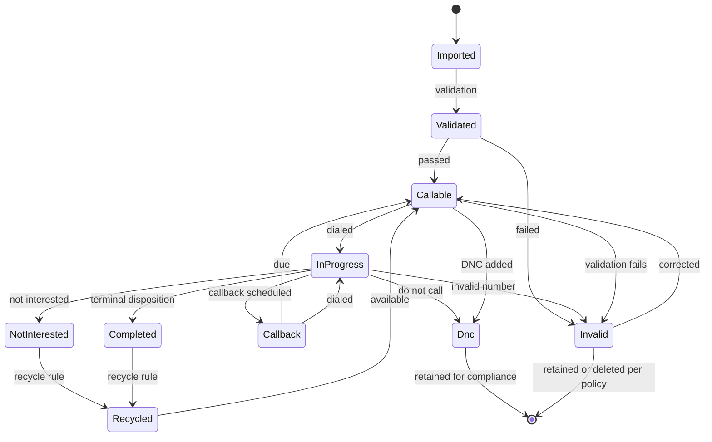

# 49 — Lead Lifecycle

**Document Control**

| Property | Value |
|----------|-------|
| Title | Lead Lifecycle |
| Version | 1.0.0 |
| Status | Draft |
| Author | Enterprise Architecture Team |
| Last Updated | 21-Jul-2026 |

---

## 1. Introduction

This document defines the lead lifecycle for the RDCS In-House Dialer Platform. It covers lead creation, validation, assignment, dialing, disposition, recycling, and archival.

## 2. Lead Lifecycle Diagram

## 3. Lead Statuses

| Status | Description |
|--------|-------------|
| pending | Lead imported but not yet validated |
| callable | Lead is eligible to be dialed |
| in-progress | Lead is currently being dialed |
| completed | Terminal disposition applied (e.g., converted) |
| callback | Callback scheduled for future |
| dnc | Lead matches DNC list or was marked DNC |
| invalid | Lead data invalid (phone, timezone, etc.) |
| not-interested | Lead declined; may be recyclable |
| recycled | Lead recycled and re-entered callable queue |

## 4. Lead Creation

Leads are created through:
- CSV import (bulk).
- API creation (single or bulk).
- CRM integration sync.
- Manual entry.

Each lead is associated with a tenant, campaign, and optionally a lead list.

## 5. Lead Validation

Validation steps:
- Required fields present (phone, timezone).
- Phone number format valid (E.164).
- Timezone derivable from ZIP/phone/address.
- Email format valid if provided.
- DNC list scrubbing.
- Duplicate check within campaign.
- Custom field validation.

Validation results are recorded in the lead import log and lead status.

## 6. DNC Scrubbing

DNC scrubbing occurs:
- At import time.
- Before every dial attempt.
- When a new DNC entry is added.

Matching leads are marked `dnc` and blocked from dialing.

## 7. Duplicate Handling

Duplicate detection by:
- Phone number within campaign (default).
- External ID within campaign (optional).
- Combination of name + phone + campaign.

Duplicate strategy:
- Reject duplicates.
- Update existing lead.
- Flag as duplicate for review.

## 8. Lead Assignment

Assignment rules:
- **Manual**: Supervisor assigns specific leads to agents/teams.
- **Round-robin**: Leads distributed evenly among agents/teams.
- **Skill-based**: Leads matched to agents based on attributes.
- **Pool**: Leads remain in team/campaign pool and picked by dialer.
- **Territory**: Leads assigned by geographic/department rules.

Assigned leads are reserved for the assigned agent or team until reassigned or completed.

## 9. Dialing

Callable leads are selected by the Dialer Worker based on:
- Campaign status and schedule.
- Agent availability and assignment.
- Timezone window.
- Priority and last dialed time.
- Recycle eligibility.
- DNC status.

On dial, lead status changes to `in-progress` and a call record is created.

## 10. Disposition Outcomes

After a call, the lead status is updated based on disposition:

| Disposition Category | Lead Status | Recyclable? |
|----------------------|-------------|-------------|
| converted | completed | No |
| not-interested | not-interested | Yes (if configured) |
| no-answer | callable | Yes (after interval) |
| busy | callable | Yes (after interval) |
| voicemail | callable | Yes (after interval) |
| callback | callback | N/A |
| dnc | dnc | No |
| invalid | invalid | No |
| fax-machine | invalid | No |

## 11. Recycling

Leads are recycled when:
- Disposition is in the recycle map.
- Maximum recycle attempts not exceeded.
- Recycle interval has elapsed.
- Lead is not DNC.
- Timezone window is respected on next dial.

Recycle job runs periodically to re-queue eligible leads.

## 12. Callbacks

Callbacks are scheduled:
- By agent during call.
- By system based on disposition rules.
- Manually by supervisor.

Callback record stores date, time, timezone, agent, notes. At scheduled time, the lead status returns to `callable` and the callback is offered to the assigned agent.

## 13. DNC Management

Leads can be marked DNC:
- During call by agent.
- Via DNC list import/match.
- Via API or CRM integration.
- By compliance officer.

DNC leads are retained for compliance; they are not deleted unless required by policy.

## 14. Invalid Lead Handling

Invalid leads are flagged with a reason (bad phone, missing timezone, etc.). They can be:
- Corrected by supervisor/agent and revalidated.
- Bulk deleted or excluded from campaign.
- Exported for data cleansing.

## 15. Lead Archival

- Leads in completed campaigns can be archived after a retention period.
- Archived leads are read-only.
- DNC leads retained per compliance policy.
- Deletion requires appropriate permission and audit logging.

## 16. Lead Events

| Event | Emitted On |
|-------|------------|
| LeadImported | Import job completes |
| LeadValidated | Validation completes |
| LeadStatusChanged | Status transition |
| LeadAssigned | Assignment occurs |
| LeadRecycled | Recycling occurs |
| DncMatchFound | Lead matches DNC |
| CallbackScheduled | Callback created |
| LeadExported | Lead data exported |

## 17. Lead Search & Filtering

- Search by name, phone, email, external ID.
- Filter by status, campaign, list, assignment, date range.
- Sort by priority, last dialed, created date.
- Bulk actions: assign, update status, export, recycle, delete.

## 18. Compliance in Lead Lifecycle

- DNC scrubbing at every stage.
- Timezone window enforcement before dialing.
- Consent tracking for recording.
- Audit trail for status changes and DNC marks.
- Data retention and deletion policies.

## 19. Lead Lifecycle API

Key endpoints from `40-rest-api-documentation.md`:
- `POST /leads` — create lead
- `POST /leads/import` — bulk import
- `PATCH /leads/:id` — update lead
- `POST /leads/:id/assign` — assign lead
- `POST /leads/:id/recycle` — recycle lead
- `POST /leads/:id/dnc` — mark DNC
- `POST /leads/:id/callbacks` — schedule callback
- `GET /leads/:id/calls` — call history

## 20. Monitoring

- Lead import volume and validation success rate.
- Callable lead pool depth per campaign.
- Lead status distribution.
- Recycling rate and callback completion rate.
- DNC match rate and compliance violations.
- Lead assignment fairness and agent load.
