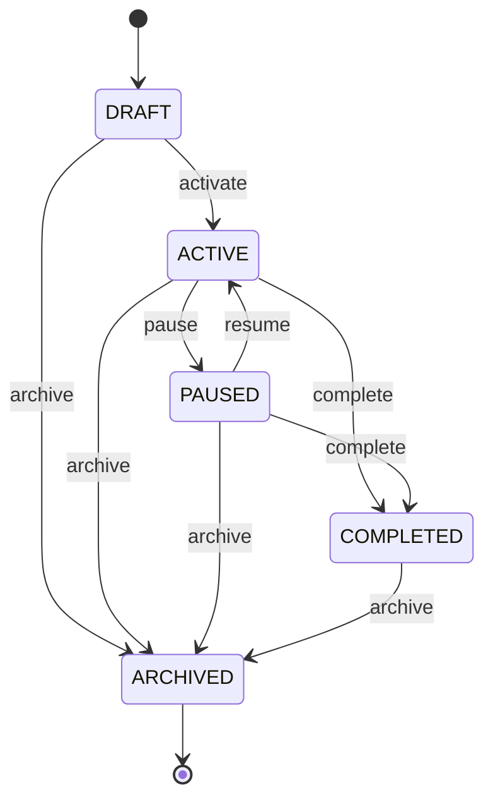

# Campaign State Machine

## States

### DRAFT
- **Description**: Campaign is being configured and is not yet active
- **Allowed Transitions**: ACTIVE, ARCHIVED
- **Modifiable**: Yes - all fields can be edited
- **Deletable**: Yes
- **Can Start Dialing**: No

### ACTIVE
- **Description**: Campaign is active and eligible for dialing
- **Allowed Transitions**: PAUSED, COMPLETED, ARCHIVED
- **Modifiable**: No - only status transitions allowed
- **Deletable**: No
- **Can Start Dialing**: Yes

### PAUSED
- **Description**: Campaign is temporarily paused
- **Allowed Transitions**: ACTIVE, COMPLETED, ARCHIVED
- **Modifiable**: No - only status transitions allowed
- **Deletable**: No
- **Can Start Dialing**: No

### COMPLETED
- **Description**: Campaign has finished its lifecycle
- **Allowed Transitions**: ARCHIVED
- **Modifiable**: No - only status transitions allowed
- **Deletable**: No
- **Can Start Dialing**: No

### ARCHIVED
- **Description**: Campaign is archived for historical purposes
- **Allowed Transitions**: None (terminal state)
- **Modifiable**: No
- **Deletable**: No
- **Can Start Dialing**: No

## State Transition Diagram



## Transition Rules

### Valid Transitions

| From State | To State | Permission Required | Audit Event |
|------------|----------|---------------------|-------------|
| DRAFT | ACTIVE | campaigns:update | campaign.activated |
| DRAFT | ARCHIVED | campaigns:update | campaign.archived |
| ACTIVE | PAUSED | campaigns:update | campaign.paused |
| ACTIVE | COMPLETED | campaigns:update | campaign.completed |
| ACTIVE | ARCHIVED | campaigns:update | campaign.archived |
| PAUSED | ACTIVE | campaigns:update | campaign.resumed |
| PAUSED | COMPLETED | campaigns:update | campaign.completed |
| PAUSED | ARCHIVED | campaigns:update | campaign.archived |
| COMPLETED | ARCHIVED | campaigns:update | campaign.archived |

### Invalid Transitions

| From State | To State | Reason |
|------------|----------|--------|
| ACTIVE | DRAFT | Cannot revert to draft |
| PAUSED | DRAFT | Cannot revert to draft |
| COMPLETED | DRAFT | Cannot revert to draft |
| COMPLETED | ACTIVE | Cannot reactivate completed campaign |
| COMPLETED | PAUSED | Cannot pause completed campaign |
| ARCHIVED | DRAFT | Cannot unarchive |
| ARCHIVED | ACTIVE | Cannot unarchive |
| ARCHIVED | PAUSED | Cannot unarchive |
| ARCHIVED | COMPLETED | Cannot unarchive |

## Implementation

The state machine is implemented in `CampaignService.isValidTransition()`:

```typescript
private isValidTransition(current: string, next: string): boolean {
  const transitions: Record<string, string[]> = {
    draft: ['active', 'archived'],
    active: ['paused', 'completed', 'archived'],
    paused: ['active', 'completed', 'archived'],
    completed: ['archived'],
    archived: [],
  };

  return transitions[current]?.includes(next) || false;
}
```

## Behavior by State

### DRAFT Behavior
- All campaign fields are editable
- Lead lists can be attached/detached
- Dispositions can be configured
- Calling windows can be configured
- Caller IDs can be configured
- Campaign can be deleted
- Campaign cannot be dialed

### ACTIVE Behavior
- Campaign fields are read-only
- Lead lists can be attached/detached (for adding new leads)
- Dispositions are read-only
- Calling windows are read-only
- Caller IDs are read-only
- Campaign cannot be deleted
- Campaign can be dialed
- Leads can be assigned and contacted

### PAUSED Behavior
- Campaign fields are read-only
- Lead lists can be attached/detached (for adding new leads)
- Dispositions are read-only
- Calling windows are read-only
- Caller IDs are read-only
- Campaign cannot be deleted
- Campaign cannot be dialed
- Existing assignments remain valid

### COMPLETED Behavior
- Campaign fields are read-only
- Lead lists cannot be modified
- Dispositions are read-only
- Campaign cannot be deleted
- Campaign cannot be dialed
- Historical data preserved

### ARCHIVED Behavior
- Campaign is read-only
- No modifications allowed
- Campaign cannot be deleted
- Campaign cannot be dialed
- Data preserved for reporting

## Audit Events

All state transitions generate audit events:

- `campaign.activated` - Campaign transitioned from DRAFT to ACTIVE
- `campaign.paused` - Campaign transitioned from ACTIVE to PAUSED
- `campaign.resumed` - Campaign transitioned from PAUSED to ACTIVE
- `campaign.completed` - Campaign transitioned to ACTIVE/PAUSED to COMPLETED
- `campaign.archived` - Campaign transitioned to ARCHIVED

Audit events include:
- tenantId
- userId (who performed the transition)
- campaignId
- previousStatus
- newStatus
- timestamp
