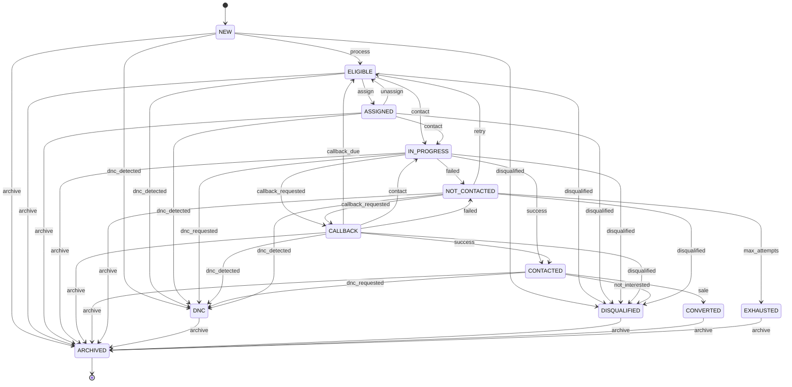

# Lead Lifecycle

## States

### NEW
- **Description**: Lead has been imported or created but not yet processed
- **Allowed Transitions**: ELIGIBLE, DNC, DISQUALIFIED, ARCHIVED
- **Contactable**: No (needs to be processed first)
- **Assignment**: Can be assigned

### ELIGIBLE
- **Description**: Lead is eligible for contact attempts
- **Allowed Transitions**: ASSIGNED, IN_PROGRESS, DNC, DISQUALIFIED, ARCHIVED
- **Contactable**: Yes
- **Assignment**: Can be assigned

### ASSIGNED
- **Description**: Lead has been assigned to an agent or team
- **Allowed Transitions**: IN_PROGRESS, ELIGIBLE, DNC, DISQUALIFIED, ARCHIVED
- **Contactable**: Yes
- **Assignment**: Can be reassigned

### IN_PROGRESS
- **Description**: Lead is currently being contacted
- **Allowed Transitions**: CONTACTED, NOT_CONTACTED, CALLBACK, DNC, DISQUALIFIED, ARCHIVED
- **Contactable**: Yes (in progress)
- **Assignment**: Can be reassigned

### CALLBACK
- **Description**: Lead has a scheduled callback
- **Allowed Transitions**: ELIGIBLE, IN_PROGRESS, CONTACTED, NOT_CONTACTED, DNC, DISQUALIFIED, ARCHIVED
- **Contactable**: Only at callback time
- **Assignment**: Can be reassigned

### CONTACTED
- **Description**: Lead was successfully contacted
- **Allowed Transitions**: CONVERTED, DISQUALIFIED, DNC, ARCHIVED
- **Contactable**: No (unless disposition allows retry)
- **Assignment**: Can be reassigned

### NOT_CONTACTED
- **Description**: Contact attempt was unsuccessful
- **Allowed Transitions**: ELIGIBLE, CALLBACK, DNC, DISQUALIFIED, EXHAUSTED, ARCHIVED
- **Contactable**: Yes (if retry allowed)
- **Assignment**: Can be reassigned

### DNC
- **Description**: Lead is on Do Not Call list
- **Allowed Transitions**: ARCHIVED
- **Contactable**: No
- **Assignment**: Cannot be assigned

### DISQUALIFIED
- **Description**: Lead does not meet campaign criteria
- **Allowed Transitions**: ARCHIVED
- **Contactable**: No
- **Assignment**: Cannot be assigned

### CONVERTED
- **Description**: Lead converted to customer/sale
- **Allowed Transitions**: ARCHIVED
- **Contactable**: No
- **Assignment**: Cannot be assigned

### EXHAUSTED
- **Description**: All contact attempts exhausted
- **Allowed Transitions**: ARCHIVED
- **Contactable**: No
- **Assignment**: Cannot be assigned

### ARCHIVED
- **Description**: Lead is archived for historical purposes
- **Allowed Transitions**: None (terminal state)
- **Contactable**: No
- **Assignment**: Cannot be assigned

## State Transition Diagram



## Transition Rules

### Valid Transitions

| From State | To State | Trigger | Audit Event |
|------------|----------|---------|-------------|
| NEW | ELIGIBLE | Import processed | lead.processed |
| NEW | DNC | DNC detected | lead.dnc |
| NEW | DISQUALIFIED | Invalid data | lead.disqualified |
| NEW | ARCHIVED | Manual archive | lead.archived |
| ELIGIBLE | ASSIGNED | Manual assignment | lead.assigned |
| ELIGIBLE | IN_PROGRESS | Contact attempt | lead.contact_started |
| ELIGIBLE | DNC | DNC detected | lead.dnc |
| ELIGIBLE | DISQUALIFIED | Criteria not met | lead.disqualified |
| ELIGIBLE | ARCHIVED | Manual archive | lead.archived |
| ASSIGNED | IN_PROGRESS | Contact attempt | lead.contact_started |
| ASSIGNED | ELIGIBLE | Unassigned | lead.unassigned |
| ASSIGNED | DNC | DNC detected | lead.dnc |
| ASSIGNED | DISQUALIFIED | Criteria not met | lead.disqualified |
| ASSIGNED | ARCHIVED | Manual archive | lead.archived |
| IN_PROGRESS | CONTACTED | Successful contact | lead.contacted |
| IN_PROGRESS | NOT_CONTACTED | Failed contact | lead.not_contacted |
| IN_PROGRESS | CALLBACK | Callback requested | lead.callback_scheduled |
| IN_PROGRESS | DNC | DNC requested | lead.dnc |
| IN_PROGRESS | DISQUALIFIED | Disqualified | lead.disqualified |
| IN_PROGRESS | ARCHIVED | Manual archive | lead.archived |
| CALLBACK | ELIGIBLE | Callback due | lead.callback_due |
| CALLBACK | IN_PROGRESS | Contact attempt | lead.contact_started |
| CALLBACK | CONTACTED | Successful contact | lead.contacted |
| CALLBACK | NOT_CONTACTED | Failed contact | lead.not_contacted |
| CALLBACK | DNC | DNC detected | lead.dnc |
| CALLBACK | DISQUALIFIED | Disqualified | lead.disqualified |
| CALLBACK | ARCHIVED | Manual archive | lead.archived |
| CONTACTED | CONVERTED | Sale/conversion | lead.converted |
| CONTACTED | DISQUALIFIED | Not interested | lead.disqualified |
| CONTACTED | DNC | DNC requested | lead.dnc |
| CONTACTED | ARCHIVED | Manual archive | lead.archived |
| NOT_CONTACTED | ELIGIBLE | Retry allowed | lead.retry_eligible |
| NOT_CONTACTED | CALLBACK | Callback requested | lead.callback_scheduled |
| NOT_CONTACTED | DNC | DNC detected | lead.dnc |
| NOT_CONTACTED | DISQUALIFIED | Disqualified | lead.disqualified |
| NOT_CONTACTED | EXHAUSTED | Max attempts | lead.exhausted |
| NOT_CONTACTED | ARCHIVED | Manual archive | lead.archived |
| DNC | ARCHIVED | Archive | lead.archived |
| DISQUALIFIED | ARCHIVED | Archive | lead.archived |
| CONVERTED | ARCHIVED | Archive | lead.archived |
| EXHAUSTED | ARCHIVED | Archive | lead.archived |
| ARCHIVED | - | Terminal state | - |

## Disposition-Based Transitions

Dispositions can trigger automatic state transitions based on their configuration:

| Disposition Category | Outcome | Retry Behavior | Callback Eligible | DNC Behavior | Resulting State |
|---------------------|---------|----------------|------------------|-------------|-----------------|
| positive | terminal | no_retry | false | no_dnc | CONTACTED |
| positive | terminal | no_retry | true | no_dnc | CONVERTED |
| negative | terminal | no_retry | false | no_dnc | DISQUALIFIED |
| negative | terminal | no_retry | false | add_dnc | DNC |
| neutral | non_terminal | retry_later | false | no_dnc | NOT_CONTACTED |
| neutral | non_terminal | retry_later | true | no_dnc | CALLBACK |
| callback | non_terminal | no_retry | true | no_dnc | CALLBACK |
| dnc | terminal | no_retry | false | add_dnc | DNC |

## Implementation

The lead lifecycle is enforced through the LeadService with validation of state transitions:

```typescript
private isValidLeadTransition(current: string, next: string): boolean {
  const transitions: Record<string, string[]> = {
    new: ['eligible', 'dnc', 'disqualified', 'archived'],
    eligible: ['assigned', 'in_progress', 'dnc', 'disqualified', 'archived'],
    assigned: ['in_progress', 'eligible', 'dnc', 'disqualified', 'archived'],
    in_progress: ['contacted', 'not_contacted', 'callback', 'dnc', 'disqualified', 'archived'],
    callback: ['eligible', 'in_progress', 'contacted', 'not_contacted', 'dnc', 'disqualified', 'archived'],
    contacted: ['converted', 'disqualified', 'dnc', 'archived'],
    not_contacted: ['eligible', 'callback', 'dnc', 'disqualified', 'exhausted', 'archived'],
    dnc: ['archived'],
    disqualified: ['archived'],
    converted: ['archived'],
    exhausted: ['archived'],
    archived: [],
  };

  return transitions[current]?.includes(next) || false;
}
```

## Audit Events

All state transitions generate audit events:

- `lead.processed` - Lead transitioned from NEW to ELIGIBLE
- `lead.assigned` - Lead assigned to agent/team
- `lead.unassigned` - Lead unassigned
- `lead.contact_started` - Contact attempt started
- `lead.contacted` - Lead successfully contacted
- `lead.not_contacted` - Contact attempt failed
- `lead.callback_scheduled` - Callback scheduled
- `lead.callback_due` - Callback due
- `lead.dnc` - Lead added to DNC
- `lead.disqualified` - Lead disqualified
- `lead.converted` - Lead converted
- `lead.exhausted` - Lead exhausted
- `lead.archived` - Lead archived

Audit events include:
- tenantId
- userId (who performed the transition)
- leadId
- previousStatus
- newStatus
- dispositionId (if applicable)
- timestamp
